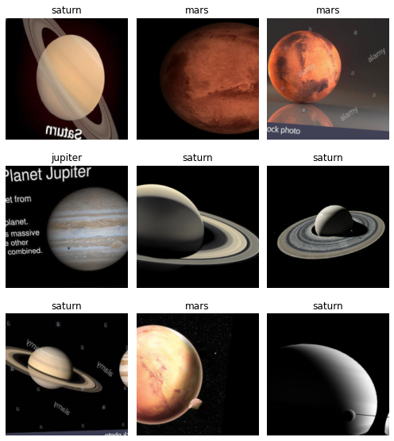
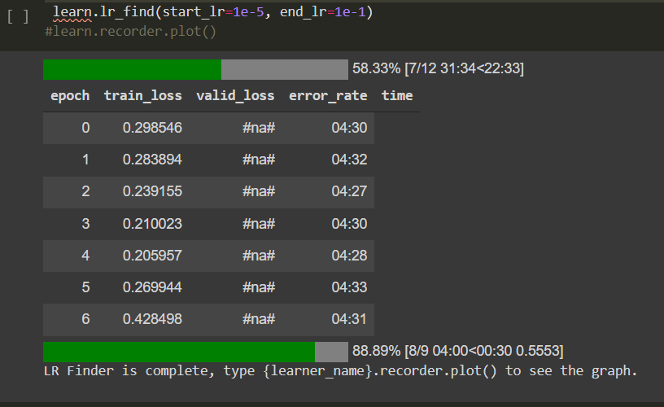
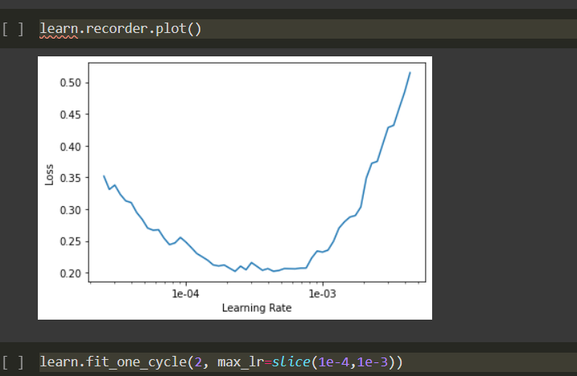
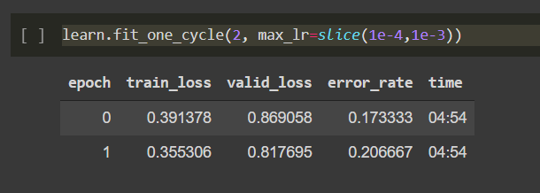
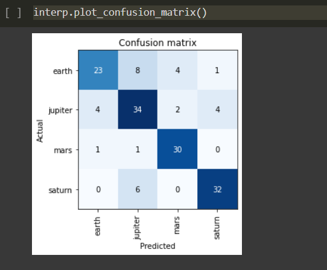
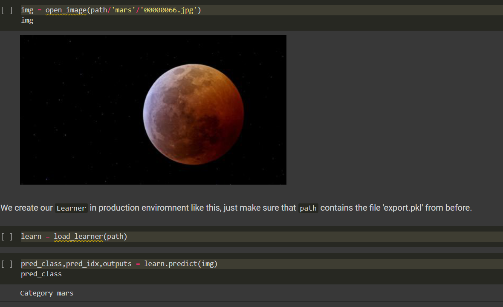

# Planet Recognition

## Table of contents

- [The challenge](#the-challenge)
  - [Overview](#overview)
- [My process](#my-process)
  - [Built with](#built-with)
  - [Result of classifier](#result-of-classifier)
  - [How to download images](#how-to-download-images)
  - [Useful resources](#useful-resources)
- [Author](#author)

## The challenge

Create a Python program to determine the understanding of Convolutional Neural Network, resnet34 and deep learning skills. Handson experience on Jupyter Notebook code.

### Overview

In this project, we have used Convolutional Neural Network to identify the planets of our solar system.

## My process

- First planets(Earth, Mars, Jupiter, Saturn) images were scrapped from google using javascript code.
- Then images of each planet were labeled and stored in separate folders 
- The images were transformed using get_transforms() method. Following random transforms were applied on each image:
  - flip
  - rotation
  - zoom
  - lightning and contrast change
  - symmetric warp of magnitude
  - affine transform

- The labelled dataset was trained using CNN with resnet34 model. The Metric used was error_rate.
- The Learning rate was calculated using "lr_find()" and "recorder.plot()" methods. 

- (Learning Rate Value= slice(1e-04,1e-03)
- The training was done on Google Colab with GPU Hardware accelerator. It took around 10 minutes to complete the training.
- The model ended up with a 20% error_rate.

- Confusion Matrix

### How to download images:

- Open your favorite browser (Firefox recommended)
- Search the image on Google.
- Inspect the page and open the console.
- Copy and paste the code written in [dowload_images.js](files/download_images.js) file and run.

### Built with

- Python 3
- pandas
- fastai

### Result of classifier

### Useful resources

- [JS File to download images](files/download_images.js) 
- [Fastai Documentation](https://docs.fast.ai/) - This helped me for understanding all concepts of fastai library. This is the top of my list for machine learning development.

## Author

- [Abhinav Shukla](Programmer,TCS,Pune)